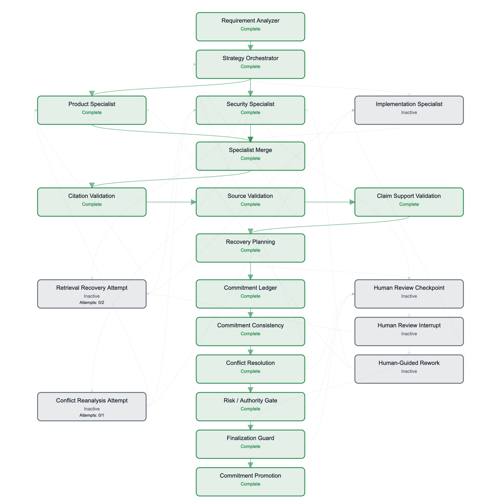

# Architecture execution snapshot — RFP-002

This is a static capture of the implemented Streamlit map's SVG after the frozen synthetic **RFP-002** offline run. The map was rendered from the actual LangGraph custom-event state: Product and Security completed as independent peers, Implementation was not invoked, both selected branches joined at Merge, and the guarded response finalized. Unused recovery, conflict-reanalysis, and human-review routes remain gray. This image is a completed-run snapshot, not a claim that every possible route executes in one run or that a model provider was called.

The source SVG came from `render_architecture_html` in `src/rfp_orchestrator/architecture_map.py` using `stream_sample_requirement` in `src/rfp_orchestrator/ui.py`. `scripts/capture_step_5_13_architecture.py` verifies the selected peers and state, flattens only CSS colors for standalone rendering, and verifies this PNG's dimensions and the companion metrics table. The PNG was rendered locally from that SVG at 1800 × 1800 pixels. SHA-256: `ce9ad3bdda019c5892565b136883e7468f653855aec1c677cb21936ffd2af8f9`.

The live UI animates these node and arrow states as events arrive; the PNG intentionally shows one finished cross-domain path. It contains only fictitious data and no credentials, raw retrieved passages, or customer information.
